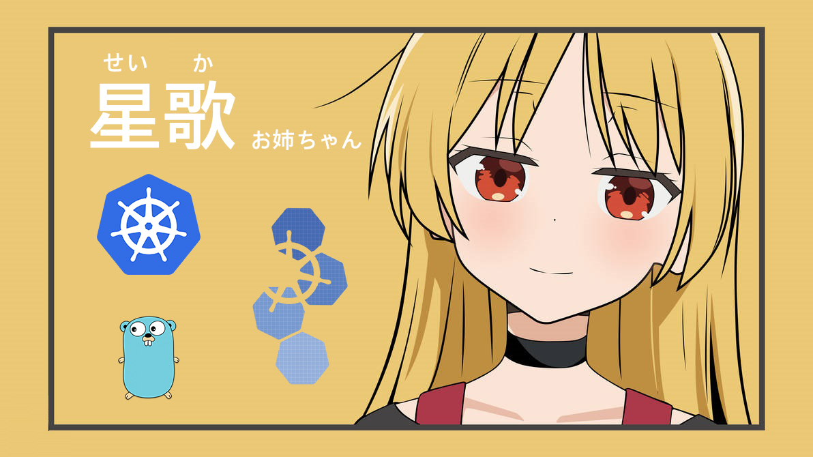

# Seika - 星歌

[](https://www.apache.org/licenses/LICENSE-2.0)


Kubernetes Custom Resource maintains quantity of Pods in each Node



## 1. Introduction

Seika is a Kubernetes Custom Resource maintains quantity of Pods in each Node without creating many ReplicaSet or Deployment.

This document is for **use purpose** only. All you need is in `dist/`

## 2. Install

Install CRD to your Kubernetes System

```bash 
$ kubectl apply -f dist/install.yaml
```

## 3. How to use

Take a quick view in `dist/seika-sample.yaml`

```yaml
apiVersion: batch.bonavadeur.io/v1
kind: Seika
metadata:
  labels:
    app.kubernetes.io/name: seika
    app.kubernetes.io/instance: seika-sample
    app.kubernetes.io/part-of: seika
    app.kubernetes.io/managed-by: kustomize
    app.kubernetes.io/created-by: seika
  name: seika-sample
spec:
  repurika:
    node1: 1
    node2: 2
    node3: 3
  selector:
    matchLabels:
      bonavadeur.io/seika: seika-sample
  template:
    spec:
      containers:
      - name: shuka
        image: docker.io/bonavadeur/shuka:sleep
```

Note: 
+ Pod's labels is not required. Pods are labeled with Seika's Labels. In the yaml file above, Pods are labels with `bonavadeur.io/seika: seika-sample`  
+ `.spec.repurika` field specify quantity of Pods in each node, with key is nodename and value is an integer specify desired number of Pods in that node

Let's apply a Seika Instance

```bash
$ kubectl apply -f dist/seika-sample.yaml
$ kubectl get pod | grep seika
seika-sample-node1-u8knc       1/1     Running   0               15m    10.233.102.166   node1   <none>           <none>
seika-sample-node2-cgo5g       1/1     Running   0               16m    10.233.75.25     node2   <none>           <none>
seika-sample-node2-qkp5u       1/1     Running   0               16m    10.233.75.47     node2   <none>           <none>
seika-sample-node3-7qf9g       1/1     Running   0               8s     10.233.71.45     node3   <none>           <none>
seika-sample-node3-efl0y       1/1     Running   0               9s     10.233.71.49     node3   <none>           <none>
seika-sample-node3-q8i96       1/1     Running   0               16m    10.233.71.43     node3   <none>           <none>
$ kubectl get seika
NAME           NODES                       READY
seika-sample   ["node1","node2","node3"]   1-2-3/1-2-3
```

## 4. For Development

### 4.1. Build and Run commands

```bash
# install CRD to Kubernetes
$ make install
$ make uninstall
# run Seika controller locally
$ make run
# build Docker image and push to DockerHub
$ make docker-build docker-push IMG=docker.io/bonavadeur/seika:v1.2
# deploy and undeploy
$ make deploy IMG=docker.io/bonavadeur/seika:v1.2
$ make undeploy
# regenerate manifest whenever you make a change to api/v1/seika_types.go
$ make generate IMG=docker.io/bonavadeur/seika:v1.2
$ make manifests IMG=docker.io/bonavadeur/seika:v1.2
# build install.yaml file
$ make build-installer IMG=docker.io/bonavadeur/seika:v1.2
```

### 4.2. Edit Seika using kubectl patch

```bash
$ kubectl patch seika seika-sample --type=merge --patch '{"spec":{"repurika":{"node1":1,"node2":2,"node3":1}}}'
```

### 4.3. Edit Seika using client-go library

```go
import (
  "encoding/json"
  "fmt"
  "context"

  "k8s.io/apimachinery/pkg/runtime/schema"
  metav1 "k8s.io/apimachinery/pkg/apis/meta/v1"
  "k8s.io/apimachinery/pkg/types"
  "k8s.io/apimachinery/pkg/apis/meta/v1/unstructured"
)

func patchSeika(desiredPods map[string]int32) {
	gvr := schema.GroupVersionResource{
		Group:    "batch.bonavadeur.io",
		Version:  "v1",
		Resource: "seikas",
	}

	// Define the patch data
	repurika := map[string]interface{}{}
	for _, nodename := range NODENAMES {
		repurika[nodename] = desiredPods[nodename]
	}
	patchData := map[string]interface{}{
		"spec": map[string]interface{}{
			"repurika": repurika,
		},
	}

	// Convert patch data to JSON
	patchBytes, err := json.Marshal(patchData)
	if err != nil {
		fmt.Printf("Error marshalling patch data: %v", err)
	}

	// Namespace and resource name
	namespace := "default"
	resourceName := "seika-sample"

	// Execute the patch request
	patchedResource, err := DYNCLIENT.Resource(gvr).
		Namespace(namespace).
		Patch(context.TODO(), resourceName, types.MergePatchType, patchBytes, metav1.PatchOptions{})
	if err != nil {
		fmt.Errorf("Error patching resource: ", err)
	} else {
		resource, found, _ := unstructured.NestedString(patchedResource.Object, "metadata", "name")
		if !found {
			fmt.Errorf("Seika not found:", err)
		}
		fmt.Println("Patched resource:", resource)
	}
}
```

## 5. Contributeur

Đào Hiệp - Bonavadeur - ボナちゃん  
The Future Internet Laboratory, Room E711 C7 Building, Hanoi University of Science and Technology, Vietnam.
未来のインターネット研究室, C7 の E ７１１、ハノイ百科大学、ベトナム。  


